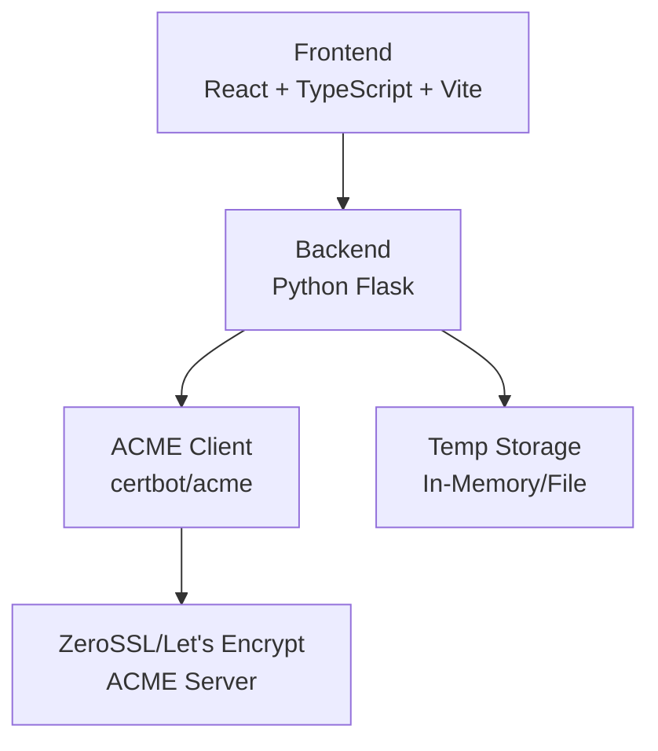
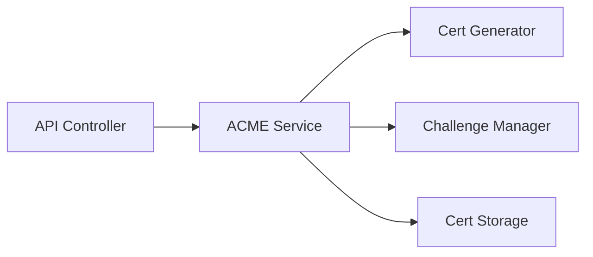

## 1. Architecture Design


## 2. Technology Description
- Frontend: React@18 + TypeScript + tailwindcss@3 + Vite
- Backend: Python Flask
- ACME Client: certbot / acme Python library
- Storage: In-memory (session-based) for temp files

## 3. Route Definitions

### Frontend Routes
| Route | Purpose |
|-------|---------|
| / | 主頁 - 填寫域名與選擇CA |
| /verify/:id | 驗證頁 - 顯示驗證方法 |
| /download/:id | 下載頁 - 下載證書 |

### Backend API Routes
| Route | Method | Purpose |
|-------|--------|---------|
| /api/request | POST | 建立SSL申請請求 |
| /api/verify/:id | GET | 取得驗證資訊 |
| /api/check/:id | POST | 檢查驗證狀態 |
| /api/cert/:id | GET | 下載證書檔案 |

## 4. API Definitions

### Type Definitions
```typescript
interface SSLRequest {
  domain: string;
  ca: 'zerossl' | 'letsencrypt';
  email?: string;
}

interface VerificationInfo {
  id: string;
  type: 'dns-01' | 'http-01';
  domain: string;
  record?: {
    type: string;
    name: string;
    value: string;
  };
  file?: {
    path: string;
    content: string;
  };
}

interface CertFiles {
  cert: string;
  key: string;
  chain: string;
}
```

### API Schemas
```typescript
// POST /api/request
type RequestRequest = SSLRequest;
type RequestResponse = { id: string };

// GET /api/verify/:id
type VerifyResponse = VerificationInfo;

// POST /api/check/:id
type CheckResponse = { 
  status: 'pending' | 'valid' | 'invalid';
  message?: string;
};

// GET /api/cert/:id?type=cert|key|chain
type CertResponse = string (file content);
```

## 5. Server Architecture Diagram


## 6. Data Model (Session-Based)
No persistent database - temp storage via Flask session + temp files
