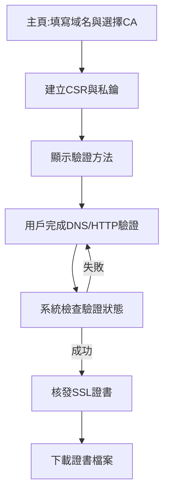

## 1. Product Overview
一鍵免費申請SSL證書的網站，簡化SSL申請流程，無需技術背景即可完成域名驗證並下載SSL證書。
- 解決繁瑣的SSL證書申請手續，讓普通用戶也能輕鬆獲取免費SSL
- 支持ZeroSSL和Let's Encrypt等免費CA服務商

## 2. Core Features

### 2.1 User Roles
| Role | Registration Method | Core Permissions |
|------|---------------------|------------------|
| Normal User | 無需註冊 | 使用所有SSL申請功能 |

### 2.2 Feature Module
1. **主頁**: 表單填寫域名、選擇CA、顯示申請步驟
2. **驗證頁**: 顯示域名所有權驗證方法（DNS/HTTP）
3. **下載頁**: 證書申請成功後提供下載

### 2.3 Page Details
| Page Name | Module Name | Feature description |
|-----------|-------------|---------------------|
| 主頁 | 表單模組 | 輸入域名、選擇SSL服務商（ZeroSSL/Let's Encrypt）、提交申請 |
| 主頁 | 進度顯示 | 即時顯示申請進度狀態 |
| 驗證頁 | 驗證資訊 | 顯示DNS記錄或HTTP檔案驗證資訊 |
| 驗證頁 | 驗證檢查 | 提供按鈕手動觸發驗證檢查 |
| 下載頁 | 證書下載 | 提供證書檔案、私鑰、中繼證書下載 |

## 3. Core Process
用戶在主頁輸入域名並選擇CA → 系統建立證書請求 → 顯示驗證方式 → 用戶完成驗證 → 系統檢查並核發證書 → 用戶下載證書

## 4. User Interface Design

### 4.1 Design Style
- 主色：藍色系 (#165DFF)，代表安全與信任
- 按鈕：圓角卡片式，有明確的視覺層次
- 字體：Inter/Noto Sans，清晰易讀
- 佈局：卡片式設計，漸進式引導
- 風格：現代簡約，強調安全與信任感

### 4.2 Page Design Overview
| Page Name | Module Name | UI Elements |
|-----------|-------------|-------------|
| 主頁 | 表單模組 | 大標題、域名輸入框、CA選擇下拉、提交按鈕、進度條 |
| 驗證頁 | 驗證資訊 | 程式碼區塊顯示驗證記錄、複製按鈕、狀態指示器 |
| 下載頁 | 下載區域 | 證書檔案卡片、下載按鈕、成功動畫 |

### 4.3 Responsiveness
- Desktop優先，流暢適配平板與手機
- 表單在小螢幕自動調整為垂直佈局
- 確保觸控按鈕尺寸足夠
